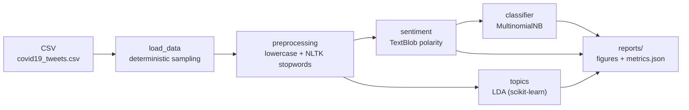

[🇧🇷 Português](README.pt-br.md) | [🇺🇸 English](README.md)

# Sentiment Analysis and Topic Modeling on COVID-19 Tweets

[](https://github.com/ntsation/tweet-sentiment-analysis/actions/workflows/pipeline_python.yaml)

NLP pipeline combining **TextBlob sentiment analysis**, **LDA topic modeling** and a **Naive Bayes classifier** over ~179k COVID-19 tweets.

> Full article in [Portuguese](README.pt-br.md).

## TL;DR

- **Dataset**: 179,108 tweets from July/August 2020 (`data/covid19_tweets.csv`)
- **Topics**: LDA surfaces masks, vaccines, daily case reports and lockdown discussions
- **Classifier**: MultinomialNB reaching **84.5% accuracy** on the held-out test set
- **Engineering**: fully typed (strict mypy), 99% test coverage, CI with ruff + pytest matrix + mypy + pip-audit + pipeline smoke test

## Pipeline



Labels are derived from TextBlob polarity (`>0` positive, `<0` negative, `0` neutral) and used as training targets for the classifier, mirroring the original notebook methodology.

## Results

### LDA topics

| Topic | Top words |
| --- | --- |
| 1 | covid19, people, mask, like, amp, know, good, realdonaldtrump, masks, year |
| 2 | covid19, pandemic, vaccine, health, amp, coronavirus, world, trump, says, virus |
| 3 | covid19, covid, 19, coronavirus, 2020, spread, news, august, latest, daily |
| 4 | cases, covid19, new, deaths, total, india, positive, coronavirus, reported, 24 |
| 5 | covid19, amp, day, home, safe, lockdown, week, stay, work, 000 |

### Naive Bayes classifier

Accuracy of **0.845** over 35,822 test tweets:

| class | precision | recall | f1-score | support |
| --- | --- | --- | --- | --- |
| negative | 0.75 | 0.66 | 0.70 | 5,724 |
| neutral | 0.87 | 0.90 | 0.88 | 16,180 |
| positive | 0.85 | 0.86 | 0.86 | 13,918 |

## Usage

```bash
make install          # create .venv and install dependencies
make run              # run pipeline on 2,000 tweets (SAMPLE=2000)
make run-full         # run on all ~179k tweets
make test             # run test suite
make coverage         # tests with coverage report
make lint             # ruff check
make typecheck        # mypy
```

Or via CLI:

```bash
python src/main.py --sample 5000 --num-topics 5 --output reports
```

Outputs land in `reports/`: `metrics.json`, `figures/sentiment_distribution.png` and per-topic word clouds.

### Docker

The image is multi-stage (builder + non-root runtime), installs from the lockfile, pre-downloads NLTK stopwords and bundles the dataset — the full pipeline runs anywhere Docker does:

```bash
make docker-build
make docker-run                                     # 2,000-tweet sample, reports in ./reports
docker run --rm -v $(pwd)/reports:/app/reports tweet-sentiment --sample 5000   # CLI args passthrough
```

Or via Compose: `docker compose up --build`.

In CI the image is scanned with **Trivy** (CRITICAL/HIGH fail the build) and pushed to **GHCR** with version, `latest` and SHA tags on `main`/releases.

## Repository structure

```
├── src/                   # typed pipeline modules + CLI
├── tests/                 # unit and end-to-end tests (synthetic fixtures)
├── notebooks/             # original exploratory notebook
├── data/                  # dataset (179,108 tweets)
├── config/                # pinned requirements + lockfile
└── .github/workflows/     # CI, weekly lockfile update, semantic release
```
