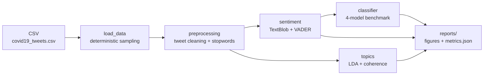

[🇧🇷 Português](README.pt-br.md) | [🇺🇸 English](README.md)

# Sentiment Analysis and Topic Modeling on COVID-19 Tweets

[](https://github.com/ntsation/tweet-sentiment-analysis/actions/workflows/pipeline_python.yaml)

NLP pipeline combining **dual sentiment annotation** (TextBlob + VADER), **LDA topic modeling with coherence-based k selection** and a **4-model classifier benchmark** over ~179k COVID-19 tweets.

> Full article in [Portuguese](README.pt-br.md).

## TL;DR

- **Dataset**: 179,108 tweets from July/August 2020 (`data/covid19_tweets.csv`)
- **Sentiment**: dual annotation — TextBlob (polarity) + VADER (social media) with agreement analysis
- **Topics**: LDA with automatic `k` selection via UMass coherence
- **Classifier**: benchmark of 4 models (MultinomialNB, ComplementNB, LogReg, LinearSVC) over TF-IDF + bigrams — **LinearSVC wins with 82.0% accuracy / 0.78 macro-F1**
- **Engineering**: fully typed (strict mypy), 99% test coverage, CI with ruff + pytest matrix + mypy + pip-audit + pipeline smoke test

## Pipeline



Labels are derived from TextBlob polarity (`>0` positive, `<0` negative, `0` neutral) and cross-checked against VADER — the agreement between both annotators lands at ~53%, showing how noisy lexical labels are.

## Results

### Model benchmark

On a 20k-tweet sample (TF-IDF + bigrams, 80/20 split, TextBlob labels):

| model | accuracy | macro-F1 |
| --- | --- | --- |
| LinearSVC | **0.820** | **0.784** |
| LogisticRegression | 0.803 | 0.752 |
| ComplementNB | 0.729 | 0.701 |
| MultinomialNB | 0.731 | 0.651 |

### LDA topics

| Topic | Top words |
| --- | --- |
| 1 | covid19, trump, need, positive, people, amp, mask, masks, face, ve |
| 2 | covid19, covid, 19, amp, pandemic, people, new, testing, health, read |
| 3 | covid19, cases, new, coronavirus, deaths, covid, 2020, india, 19, total |
| 4 | covid19, pandemic, amp, people, health, coronavirus, work, home, school, news |
| 5 | covid19, vaccine, safe, coronavirus, amp, mask, stay, social, americans, watch |

### Naive Bayes baseline (MultinomialNB)

Accuracy of **0.731** / macro-F1 **0.651** on the 20k-tweet sample — the weakest of the benchmark, motivating the model comparison above.

## Usage

```bash
make install          # create .venv and install dependencies
make run              # run pipeline on 2,000 tweets (SAMPLE=2000)
make run-full         # run on all ~179k tweets
make test             # run test suite
make coverage         # tests with coverage report
make lint             # ruff check
make typecheck        # mypy
```

Or via CLI:

```bash
python src/main.py --sample 5000 --num-topics 5 --output reports
python src/main.py --sample 20000 --tune-topics    # automatic k selection
```

Outputs land in `reports/`: `metrics.json` (topics, model benchmark, annotator agreement, timeline summary, coherence scores), `figures/sentiment_distribution.png`, `figures/sentiment_timeline.png` and per-topic word clouds.

### Docker

The image is multi-stage (builder + non-root runtime), installs from the lockfile, pre-downloads NLTK stopwords and bundles the dataset — the full pipeline runs anywhere Docker does:

```bash
make docker-build
make docker-run                                     # 2,000-tweet sample, reports in ./reports
docker run --rm -v $(pwd)/reports:/app/reports tweet-sentiment --sample 5000   # CLI args passthrough
```

Or via Compose: `docker compose up --build`.

In CI the image is scanned with **Trivy** (CRITICAL/HIGH fail the build) and pushed to **GHCR** with version, `latest` and SHA tags on `main`/releases.

## Repository structure

```
├── src/                   # typed pipeline modules + CLI
├── tests/                 # unit and end-to-end tests (synthetic fixtures)
├── notebooks/             # original exploratory notebook
├── data/                  # dataset (179,108 tweets)
├── config/                # pinned requirements + lockfile
└── .github/workflows/     # CI, weekly lockfile update, semantic release
```
