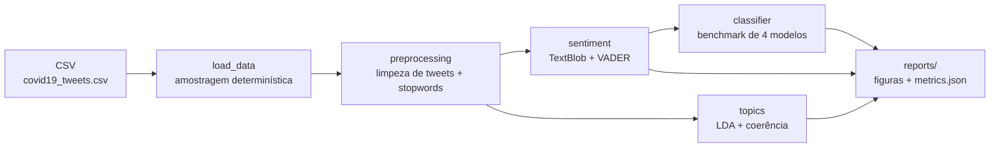

[🇧🇷 Português](README.pt-br.md) | [🇺🇸 English](README.md)

# Análise de Sentimento e Modelagem de Tópicos em Tweets sobre COVID-19

[](https://github.com/ntsation/tweet-sentiment-analysis/actions/workflows/pipeline_python.yaml)

Pipeline de NLP que combina **análise de sentimento (TextBlob)**, **modelagem de tópicos (LDA)** e um **classificador Naive Bayes** sobre ~179 mil tweets sobre a pandemia de COVID-19.

> Versão em português deste artigo. [Leia em inglês](README.md).

## TL;DR

- **Dataset**: 179.108 tweets de julho/agosto de 2020 (`data/covid19_tweets.csv`)
- **Sentimento**: dupla anotação — TextBlob (polaridade) + VADER (social media), com análise de concordância
- **Tópicos**: LDA com 5 tópicos — máscaras, vacinas, boletins de casos, lockdown — e seleção automática de `k` por coerência UMass
- **Classificador**: benchmark de 4 modelos (MultinomialNB, ComplementNB, LogReg, LinearSVC) sobre TF-IDF + bigramas — **LinearSVC vence com 82,0% de acurácia / 0,78 macro-F1**
- **Temporal**: evolução diária da polaridade média ao longo de 26 dias
- **Engenharia**: código 100% tipado (mypy strict), 99% de cobertura, CI com ruff + pytest + mypy + pip-audit + smoke do pipeline

## Contexto

Este repositório nasceu como um notebook exploratório (`notebooks/tweetML.ipynb`) e foi **produtizado**: toda a lógica foi extraída para um pacote Python testável, determinístico e executável via CLI, com a mesma qualidade de engenharia esperada de um serviço em produção.

## O pipeline



1. **Carga e amostragem** — leitura do CSV, remoção de nulos e amostragem opcional com semente fixa (`random_state=42`) para reprodutibilidade
2. **Pré-processamento** — limpeza específica de tweets: remove URLs, `@menções` e prefixo "RT", desembrulha `#hashtags`, aplica lowercase e remove stopwords do NLTK
3. **Sentimento** — dupla anotação: polaridade do TextBlob e compound do VADER (voltado para social media — emojis, MAIÚSCULAS, pontuação enfática); rótulos derivados do sinal/limiar
4. **Tópicos** — `CountVectorizer` + LDA; com `--tune-topics`, varre candidatos (3, 5, 7, 10) e escolhe o `k` de maior coerência UMass
5. **Classificador** — benchmark de MultinomialNB, ComplementNB, LogisticRegression e LinearSVC sobre TF-IDF com bigramas, split 80/20 com semente fixa
6. **Relatórios** — histograma de polaridade, tendência temporal diária, word clouds por tópico e `metrics.json` com tópicos, benchmark, concordância entre rotuladores, matriz de confusão e classification report

## Resultados

### Tópicos identificados pela LDA

| Tópico | Palavras mais relevantes | Interpretação |
| --- | --- | --- |
| 1 | covid19, people, mask, like, amp, know, good, realdonaldtrump, masks, year | Uso de máscaras / opinião pública |
| 2 | covid19, pandemic, vaccine, health, amp, coronavirus, world, trump, says, virus | Vacina e políticas de saúde |
| 3 | covid19, covid, 19, coronavirus, 2020, spread, news, august, latest, daily | Boletins e notícias diárias |
| 4 | cases, covid19, new, deaths, total, india, positive, coronavirus, reported, 24 | Números de casos e mortes |
| 5 | covid19, amp, day, home, safe, lockdown, week, stay, work, 000 | Lockdown e isolamento |

### Classificador — benchmark de modelos

Benchmark em amostra de 20 mil tweets (TF-IDF + bigramas, split 80/20, rótulos do TextBlob):

| modelo | acurácia | macro-F1 |
| --- | --- | --- |
| LinearSVC | **0,820** | **0,784** |
| LogisticRegression | 0,803 | 0,752 |
| ComplementNB | 0,729 | 0,701 |
| MultinomialNB | 0,731 | 0,651 |

O LinearSVC domina; o ComplementNB, desenhado para classes desbalanceadas, supera o MultinomialNB no macro-F1 (a classe `negative` é minoria).

### Concordância TextBlob × VADER

| métrica | valor |
| --- | --- |
| concordância geral | 52,8% |
| negative | 55,0% |
| neutral | 49,9% |
| positive | 54,9% |

Os dois rotuladores concordam em cerca de metade dos tweets — evidência de que rótulos léxicos são proxies ruidosas e um argumento forte para anotação humana ou modelo pré-treinado (ver roadmap).

### Tendência temporal

A amostra cobre 24/07–30/08/2020 (26 dias). O `metrics.json` resume o período, o dia mais negativo (18/08, TextBlob) e o mais positivo (07/08, VADER); a figura `figures/sentiment_timeline.png` mostra as duas curvas diárias lado a lado.

### Coerência de tópicos

Com `--tune-topics`, a LDA é treinada para k ∈ {3, 5, 7, 10} e o `k` de maior coerência UMass vence (na amostra: **k=3**). O `metrics.json` registra os escores de todos os candidatos.

## Produtização

O que foi feito para transformar o notebook em um projeto apresentável:

| Prática | Detalhe |
| --- | --- |
| Código tipado | `mypy` com `disallow_untyped_defs` em todo o `src/` |
| Testes unitários | 64 testes, **99% de cobertura**, fixtures sintéticas (não dependem do CSV de 66 MB) |
| Determinismo | Sementes fixas em amostragem, LDA e split; dois runs produzem o mesmo `metrics.json` |
| Lint e formato | `ruff` via pre-commit e CI |
| CI (GitHub Actions) | ruff + pytest matrix (3.11/3.12) + mypy + pip-audit + **smoke do pipeline em amostra real** |
| Docker | Imagem multi-stage non-root com dataset embutido, scan Trivy e publicação no GHCR |
| Dependências | Pins exatos, lockfile universal (`uv pip compile`) regenerado semanalmente por workflow |
| Dependabot | Atualizações diárias de dependências e actions |
| Release | python-semantic-release com versionamento semântico no `main` |

## Como usar

```bash
make install          # cria .venv e instala dependências
make run              # executa o pipeline em 2.000 tweets (SAMPLE=2000)
make run-full         # executa em todos os ~179 mil tweets
make test             # suite de testes
make coverage         # testes com relatório de cobertura
make lint             # ruff check
make format           # ruff format
make typecheck        # mypy
```

Ou diretamente pela CLI:

```bash
python src/main.py --sample 5000 --num-topics 5 --output reports
python src/main.py --sample 20000 --tune-topics    # com seleção automática de k
```

Saída em `reports/`:

- `metrics.json` — tópicos, benchmark de modelos, concordância TextBlob×VADER, resumo temporal, coerência, matriz de confusão e classification report
- `figures/sentiment_distribution.png` — distribuição da polaridade
- `figures/sentiment_timeline.png` — polaridade média diária (TextBlob × VADER)
- `figures/wordclouds/wordcloud_topic_N.png` — word cloud por tópico

### Docker

A imagem é multi-stage (builder + runtime non-root), instala a partir do lockfile, pré-baixa as stopwords do NLTK e embute o dataset — rodando o pipeline completo em qualquer lugar com Docker:

```bash
make docker-build
make docker-run                                     # amostra de 2.000 tweets, relatórios em ./reports
docker run --rm -v $(pwd)/reports:/app/reports tweet-sentiment --sample 5000   # argumentos da CLI via args
```

Ou via Compose: `docker compose up --build`.

No CI, a imagem é construída, escaneada com **Trivy** (CRITICAL/HIGH falham o build) e publicada no **GHCR** com tags de versão, `latest` e SHA a cada push no `main`/release.

## Estrutura do repositório

```
├── src/
│   ├── main.py            # CLI (argparse)
│   ├── pipeline.py        # orquestração + metrics.json
│   ├── config.py          # PipelineConfig (dataclass congelada e validada)
│   ├── preprocessing.py   # stopwords NLTK + limpeza
│   ├── sentiment.py       # TextBlob + rótulos
│   ├── topics.py          # LDA + top palavras por tópico
│   ├── classifier.py      # Naive Bayes + avaliação
│   └── visualization.py   # histograma + word clouds
├── tests/                 # unitários + end-to-end com fixtures sintéticas
├── notebooks/             # notebook exploratório original
├── data/                  # dataset (179.108 tweets)
├── config/                # requirements pinados + lockfile
├── docker/                # Dockerfile multi-stage
└── .github/workflows/     # CI, Docker CI/CD, lockfile semanal, release
```

## Roadmap

- [ ] Persistir o modelo treinado (joblib) e expor inferência como serviço
- [ ] Substituir a proxy do TextBlob por rótulos anotados ou modelo pré-treinado
- [ ] Coleta incremental de dados (streaming) e reprodutibilidade via DVC
